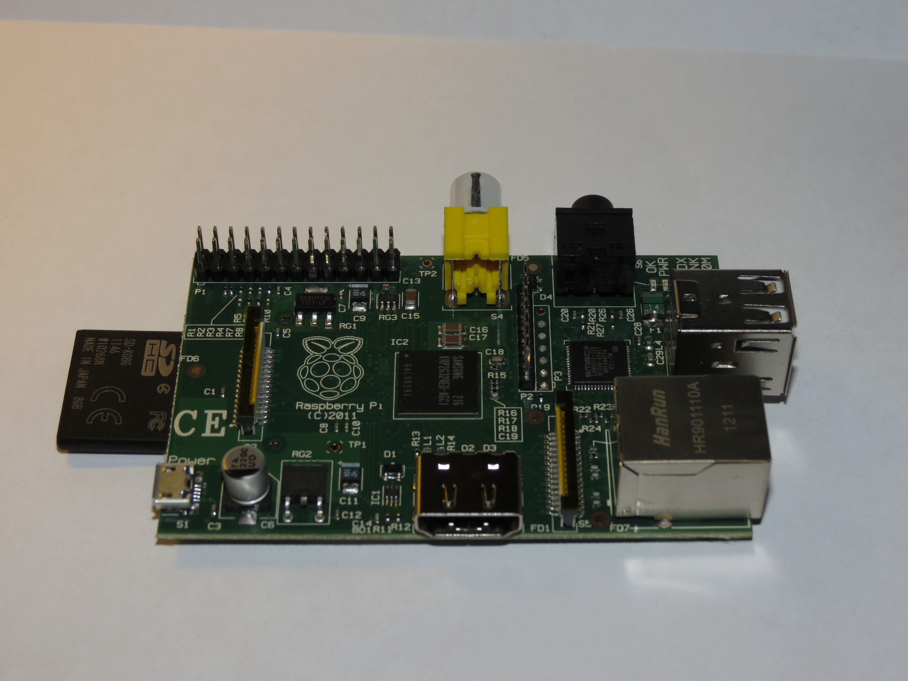

Raspberry Pi
============

   A freshly unpacked Raspberry Pi with additional SDHC card.
    
The **Raspberry Pi** is an inexpensive credit-card sized computer
designed for educational use. This page provides information about the
Raspberry Pi in the context of those looking to run :doc:`XinuPi` on
it.  Readers unfamiliar with the Raspberry Pi are advised to also see
other sources such as the `Raspberry Pi foundation's website
<http://www.raspberrypi.org/>`__.

.. contents::
   :local:

Acquiring the hardware
----------------------

Model A vs. Model B
~~~~~~~~~~~~~~~~~~~

The Raspberry Pi Model A costs $25, whereas the Raspberry Pi Model B
costs $35. We generally recommend the Model B because it includes an
Ethernet port and 2 USB ports, as opposed to the Model A which merely
has 1 USB port. Also, currently the Model B has more memory (512 MiB)
than the Model A (256 MiB), but since XinuPi is very lightweight and
only uses a small amount of the available memory, the difference in
memory is mostly irrelevant.

Hardware accessories
~~~~~~~~~~~~~~~~~~~~

One way the cost of the Raspberry Pi was kept down was increasing
modularity. A consequence of this is that a Raspberry Pi board by itself
is useless until at least two additional components have been added:

-  SD card. To boot, the Raspberry Pi requires an appropriately
   formatted SD card containing certain boot files as well as the
   operating system or kernel to run. Note: as of this writing, XinuPi
   has no SD card driver; therefore, when running XinuPi the SD card is
   only used for booting. Useful tip: Since the SD card can easily be
   removed, it is trivial to have different SD cards and swap them out
   when needed. This trick can be used to easily use the same Raspberry
   Pis for different purposes.
-  Power source. The Raspberry Pi requires 700 mA at 5V, delivered
   either through the microUSB port or through the GPIO pins. For the
   microUSB port, most cell phone chargers should work. For the GPIO
   pins, a useful trick is that a USB to TTL Serial converter, such as
   `this one <http://www.adafruit.com/products/954>`__, can double as a
   power source as well as a serial connection to the Raspberry Pi over
   which the console runs. We have primarily used the latter method
   while developing XinuPi.

Other useful hardware and accessories include the following:

-  Serial cable for text input/output to/from the Raspberry Pi, such as
   `this one <http://www.adafruit.com/products/954>`__. This is very
   important for XinuPi because this is its primary way to interact with
   a human. Furthermore, as noted above, such a serial cable can double
   as a power source. However, eventually a keyboard-and-monitor setup
   will be supported as well, providing an alternative to a serial cable
   when human interaction with the system is desired.
-  Monitor or TV to display graphics output from the Raspberry Pi. While
   important for Linux, this is less important for XinuPi, which is
   primarily intended to produce text output over a serial connection as
   described above. However, XinuPi does support a framebuffer console
   and a turtle graphics application for those interested.
-  USB devices can be plugged in and recognized, but the device driver
   support for specific devices is extremely limited at this point.
   Support for USB keyboards as an input method is in development.
-  Ethernet cable to take advantage of the networking support.
-  Case to enclose the Raspberry Pi in. This protects the board and adds
   aesthetic value; otherwise it has no purpose.

.. _Raspberry-Pi#Booting:

Booting
-------

The Raspberry Pi can only boot from its SD card, not from any external
devices, and it requires several files in order to do so. Several boot
files, which are not distributed with XinuPi, must be placed in the root
directory of a FAT-formatted partition of the SD card.

The following binary blobs (created by Broadcom, but freely
distributable, at least when using them on Raspberry Pis) must exist:

-  ``bootcode.bin`` is a first-stage bootloader.
   `Download link <https://github.com/raspberrypi/firmware/raw/master/boot/bootcode.bin>`__.
-  ``loader.bin`` is a second-stage bootloader. Apparently, this file is
   no longer required.
-  ``start.elf`` is the GPU
   firmware. `Download link <https://github.com/raspberrypi/firmware/raw/master/boot/start.elf`__.

The following text files are optional:

-  ``config.txt`` is parsed by the GPU firmware and is used to set various
   hardware parameters. XinuPi runs fine with the default parameters, so
   ``config.txt`` need not exist.
-  ``cmdline.txt`` is used to pass a command line to the Linux kernel.
   This file need not exist for the XinuPi kernel, which does not take
   command line parameters.

Finally, the actual kernel:

-  ``kernel.img`` must exist and is loaded as raw data at physical memory
   address ``0x8000`` by the GPU firmware. The ARM begins execution at the
   very first instruction in this loaded image. ``kernel.img`` can be a
   XinuPi kernel (rename ``xinu.boot`` to ``kernel.img``), a Linux kernel,
   or other bare-metal code such as the *raspbootin* bootloader.
   *raspbootin* has been helpful in developing XinuPi; see `its
   documentation <https://github.com/mrvn/raspbootin/blob/master/README.md>`__
   for more information.

There are a couple ways you can actually achieve the final result of a
properly set up SD card:

-  Follow the installation instructions for a Linux distribution
   supported on the Raspberry Pi, such as Raspbian or Arch Linux ARM.
   This will leave the appropriate boot files. To switch to XinuPi,
   simply replace ``kernel.img`` on the FAT partition with
   ``xinu.boot``.  (Perhaps rename ``kernel.img`` to ``linux.img`` to
   save a backup first.)
-  Manually partition the SD card and create a FAT filesystem, then copy
   the boot files to the filesystem. The binary blobs can be downloaded
   using the links provided above.
