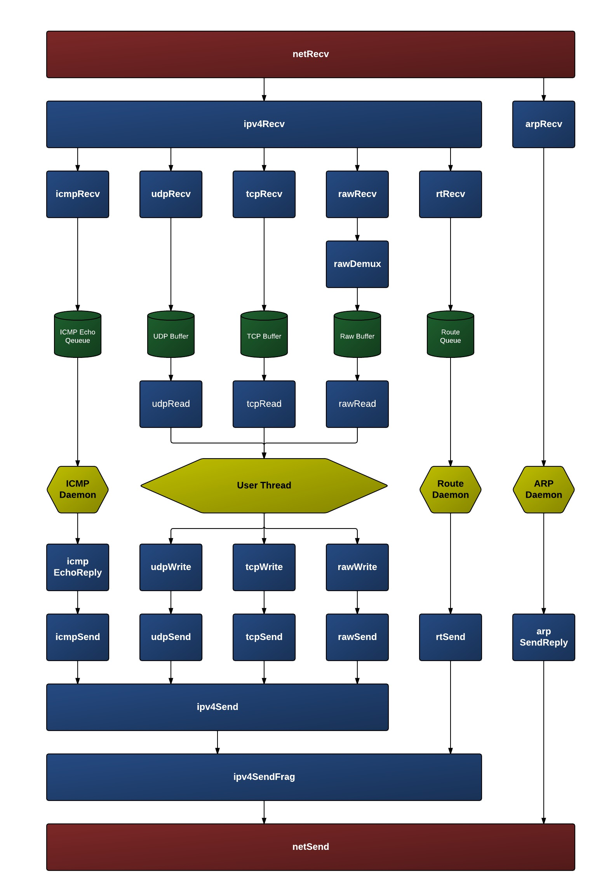

Networking
==========

Supported Protocols
-------------------

- :doc:`ARP`
- :doc:`DHCP`
- :doc:`ICMP`
- :doc:`Routing`
- :doc:`TCP`
- :doc:`TFTP`
- :doc:`UDP`

Design
------

The new network stack design does not have a NET device. The read and
write device function paradigm does not map well to the network stack.
TCP, UDP, and RAW sockets do not read from a network device, rather a
network receive thread calls a chain of receive functions to process the
packet at each layer in the network stack. A write function does not
work well for sending a packet since the final destination of the packet
is not known until the IP and/or ARP layers. The write device function
assumes the thread calling write knows exactly which device to which the
data should be written. A table of netif structures (separate from
devtab, the table of devices) is still maintained to store configuration
and accounting information for each underlying device (ETH, etc.) with
which the network stack is receiving and sending packets.

A network interface is setup using the :source:`netUp()
<network/net/netUp.c>` function. An underlying device, IP address,
mask, and gateway must be provided when calling ``netUp()``.

.. note::
    ``netUp()`` does not have :doc:`DHCP <DHCP>` built into it.
    Instead, for DHCP configuration :source:`dhcpClient()
    <network/dhcpc/dhcpClient.c>` should be called before calling
    ``netUp()``.  The DHCP client will interact directly with the
    underlying device (ETH, etc.) without using the network stack in
    order to acquire IPv4 information.

Network receive threads continually read incoming packets from an
underlying device. Each network interface has one or more network
receive threads running. The ``netRecv()`` function includes an
infinite loop which reads a packet from the underlying device and
calls ``ipv4Recv()`` or ``arpRecv()`` depending on the type of the
packet. The packet is read into a buffer declared as a local variable
within the netRecv function. At the IP layer ``ipv4Recv()`` calls
``tcpRecv()``, ``udpRecv()``, ``rawRecv()``, or passes the packet to a
routing thread. No sending of packets should ever occur under a
network receive thread. For protocols in which an incoming packet may
generate the need to send a reply packet, the protocol must have a
separate thread for sending. For example, if an incoming TCP packet
contains data which needs to be acknowledge, and ``tcpRecv()`` should
set a flag or send a message to a TCP monitor thread which will
proceed to send the acknowledgement.

A global buffer pool is allocated for storing outgoing packets. One
pool exists for use by all network interfaces. When sending a packet,
the sending function (ex. ``tcpSend()``) obtains a buffer from the
pool, calls the appropriate lower-level send function (ex.
``ipv4Send()``), and, after the function returns, returns the buffer to
the pool.

The network stack is designed to treat the Xinu backend as both a
router and a multi-homed host. Packets received on any of a backend's
network interfaces may be destined for the backend or may need to be
routed to another network destination. The network layer (IP layer)
determines how to handle incoming packets. In the function
``ipv4Recv()``, the destination of an IP packet is compared against
the IP address and broadcast address for every active network
interface. If the destination address of the IP packet matches the IP
address of the interface on which it was received or the IP address of
any other network interface, the packet is passed to the appropriate
transport layer receive function (``udpRecv()``, ``tcpRecv()``, etc.).
IP packets whose destination does not match with one of the active
network interfaces are passed to the routing module of the network
stack, i.e. the function ``rtRecv()`` is called. In ``rtRecv()`` the
packet is copied into a buffer from the global buffer pool and placed
on a queue for a routing thread to process. Currently, the network
stack does not use a selective drop algorithm when the router is
overloaded; once the queue of packets to route is full, all subsequent
packets which require routing are dropped. A routing thread processes
each packet on the routing queue. If no route is known, the packet is
dropped; otherwise the TTL is decrement, the checksum is recalculated
and the ``netSend()`` function is called. Packets being sent from the
transport layer (``udpSend()``, ``tcpSend()``, etc) are not passed to
the routing thread. The transport layer calls ``ipv4Send()`` which
performs a route table lookup, sets up the IP packet header and calls
``netSend()``.

Network Graphic
---------------

