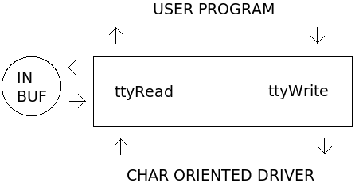

TTY driver
==========

XINU's TTY driver, located in :source:`device/tty/`,  serves as an
intermediary device between hardware device drivers and user
applications to provide line buffering of input and cooking of input
and output. The driver is purely software oriented and makes no direct
communication with physical hardware.  Instead, the TTY driver relies
on an underlying device driver to communicate directly with the
hardware.  The :doc:`XINU Shell <Shell>` utilizes a TTY device to line
buffer and cook user input read from another device, such as a UART.

Open & Close
------------

:source:`ttyOpen() <device/tty/ttyOpen.c>`, which should be called via
:source:`open() <system/open.c>`, associates a TTY with an underlying
char-oriented hardware device.  The underlying device driver must
provide both ``getc()`` and ``putc()`` functions for the TTY to obtain
input and send output character by character. The device should
already be opened and initialized before the TTY is opened.  When a
TTY is opened, its device control block, input buffer, and flags are
initialized. No input flags are set when a TTY device is opened. The
``TTY_ONLCR`` output flag is set when a TTY device is opened.

:source:`ttyClose() <device/tty/ttyClose.c>`, which should be called
via :source:`close() <system/close.c>`, disassociates a TTY from its
underlying device and resets the TTY's device control block.

Read
----

The TTY driver reads characters from an underlying device driver using
the devices ``getc()`` function. Input is first buffered in the TTY
driver's circular buffer before being copied to the user buffer
supplied as a parameter in the ``ttyRead()`` function call.

The :source:`ttyRead() <device/tty/ttyRead.c>` function begins by
checking the ``ieof`` flag to determine if the EOF character
(Control+D) was read during the last call to ``ttyRead()`` If the
``ieof`` flag is set, the function returns the ``EOF`` constant,
defined in ``stddef.h``. ``EOF`` is only returned once for each EOF
character read by the TTY driver. A call made to ``ttyRead()`` after
``EOF`` was returned, will result in an attempt to read more
characters from the underlying device driver.

If the ``TTY_IRAW`` flag is set, the TTY driver performs no line
buffering or line editing (input cooking). The user buffer is first
filled from any data remaining in the TTY driver's input buffer from the
last ``ttyRead()`` call. The remaining portion of the user supplied buffer
is filled by reading characters from the underlying device driver.

The TTY driver performs line buffering and line editing (input cooking)
when the ``TTY_IRAW`` flag is not set. Characters are read from the
underlying device driver until a line delimiter is read or the TTY
driver's input buffer is full. Lines may be terminated with the newline
(LF or ``'\n'``) or end of file (EOF or ASCII character 0x04)
characters. If the ``TTY_ECHO`` flag is set, each character is output as
it is read.

Special handling is required for some characters to perform line editing
(input cooking). If the TTY driver's input buffer contains characters,
backspace (BS or ``'\b'``) and delete (DEL or ASCII character 0x7F)
remove the last character from the TTY's input buffer. The newline and
carriage return (CR or ``'\r'``) characters are cooked if certain input
flags are set. The end of file character causes the ``ieof`` flag to be
set. Any other unprintable characters are ignored.

After a line of input is buffered in the TTY's device driver, the user
supplied buffer is filled from the TTY's input buffer. If the end of
file character was the only character read, the ``EOF`` constant is
returned. Otherwise, the number of characters read into the user buffer
is returned.

The TTY driver has the following input flags:

-  ``TTY_IRAW`` - reads input unbuffered and uncooked
-  ``TTY_INLCR`` - converts ``'\n'`` to ``'\r'``
-  ``TTY_IGNCR`` - ignores ``'\r'``
-  ``TTY_ICRNL`` - converts ``'\r'`` to ``'\n'``
-  ``TTY_ECHO`` - echoes input

Write
-----

The TTY driver does not buffer output; in :source:`ttyWrite()
<device/tty/ttyWrite.c>`, it writes characters directly to an
underlying device driver. The TTY driver cooks newlines (LF or
``'\n'``) and carriage returns (CR or ``'\r'``) if certain output
flags are set.

The TTY driver has the following output flags:

-  ``TTY_ONLCR`` - converts ``'\n'`` to ``'\r\n'``
-  ``TTY_OCRNL`` - converts ``'\r'`` to ``'\n'``

Control
-------

The TTY driver has four control functions: two to set and clear input
flags and two to set and clear output flags.  Each of control functions
returns the previous state of the flags being changed.  These are
implemented in :source:`ttyControl() <device/tty/ttyControl.c>` and
should be called via :source:`control() <system/control.c>`.
