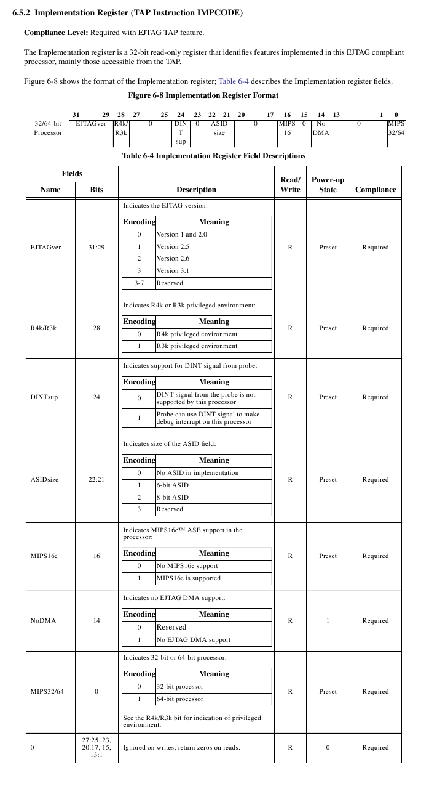

EJTAG ID Codes and Implementation Registers
===========================================

When an EJTAG system is reset, the data register is automatically filled
with the result of an IDCODE instruction. This code usually includes the
processor and the manufacturer, although it is not a standard. The
important part of the IDCODE is using it to determine if your host
hardware is communicating with your target. Whether or not the host
speaks fluent jtag, if it can navigate to the data register and shift
out the contents, one can see if the electrical connection is sound.

**IDCODEs**

WT54GLv1.1 : 0x0535217F

WRT54Gv8 : 0x1535417F

WRT350Nv1.0 : 0x0478517F

The implementation code instruction returns an indication of features on
the particular platform. Below is the information from the MIPS EJTAG
Specification, document #MD00047.

**IMPCODEs**

WT54GLv1.1 : 0x00800904

WRT54Gv8 : 0x00810904

WRT350Nv1.0 : 0x00810904

