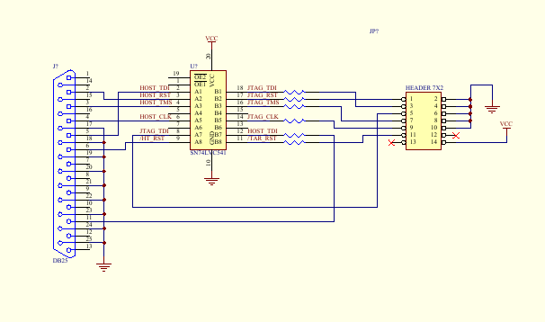
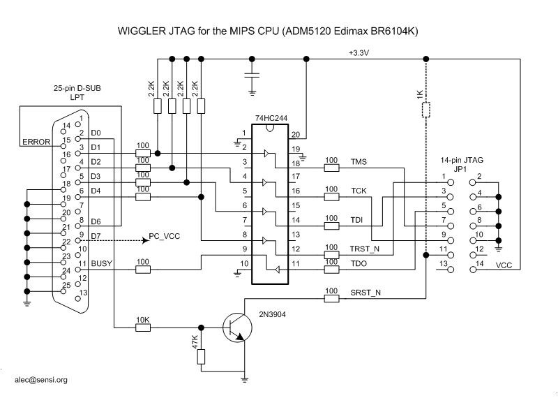
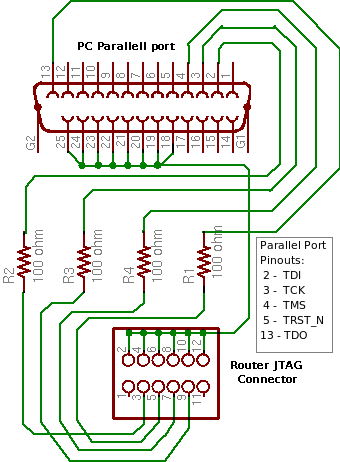
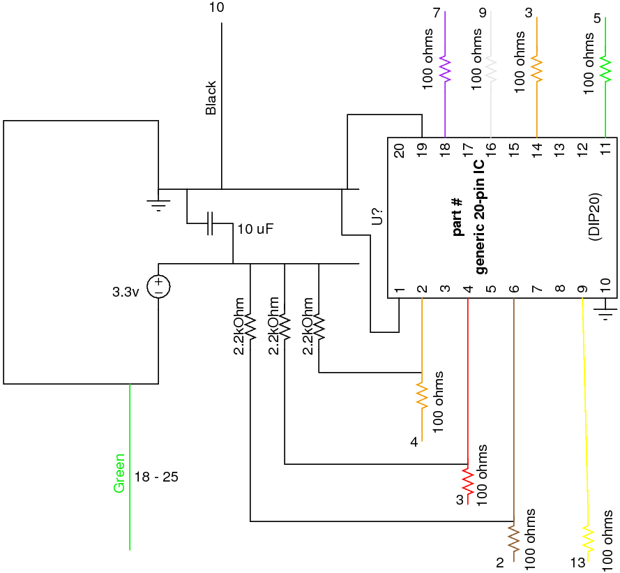

EJTAG
=====

EJTAG is a MIPS-specific extension of IEEE 1149.1, the Joint Test Action
Group. Allows interfacing with additional logic in SoC

-  direct control of processor for step-by-step debugging
-  access to busses and registers

   -  aids in debugging
   -  possible usage as additional peripheral data bus
   -  direct writing to flash for firmware updates (and de-bricking)

Debugging
---------

Attempting to use GNU debugger: http://www.gnu.org/software/gdb. GDB
uses its own Remote Serial Protocol (RDB) to communicate to remote
targets. This protocol could be used to communicate with the XINU
backends through the current serial connection. Although, this would
require additions to XINU: communication with the GDB host; altering of
exception handler to allow GDB to take control of target processor.

The use of the EJTAG port on the WRT54-series routers gives the user
hardware control of the processor, avoiding the need for strategically
placed breakpoints and XINU interrupt subsystem modification.
Additionally, requests by the debugger for specicfic data can be aquired
directly from registers. The trick to this operation is software that
can interpret commands from RDB into EJTAG signals to be sent through
the host parallel port, and vice-versa. An implementation of this
interpreter can be found at
http://www.totalembedded.com/open_source/jtag/mips32_ejtag.php.

Specific Implementations
------------------------

So far, development has focused exclusively on the WRT54GL. For anyone
investigating the capabilities of the WRT54GL EJTAG system, note the
instruction register size is a full 8 bits, not the 5 bits required by
specification. Believing the 54GL CP0 Debug Program Counter register
to be returning erroneous addresses, headers are being added to a 54G
v.8, and a 350N v.1. For IDCODEs and implementation register values
check :doc:`EJTAG-ID-Codes-and-Implementation-Registers`.

Probes
------

Images are of three variant EJTAG connections. The first two buffered by
active line drivers, the last passive. Xinu research is currently using
an active probe similar to the OpenWRT "Wiggler" clone; although, the
parallel port pinouts match the unbuffered cable diagram. Note that the
unbuffered cable at the bottom of this page is only proven by xinu
research functional in writing to the Test Access Port. It may not read
data back from the target device. Additionally, rumor claims that the
cable can be no longer than 6" (not 6'). This is partially substantiated
by photographs "out there" of similar 6 inch cables used with a variety
of devices.

   Total Embedded buffered cable

   "wiggler" clone from OpenWRT

   unbuffered cable from OpenWRT; used by de-brick utility

   Our current buffer/wiggler setup

See also
--------

- :doc:`EJTAG-ID-Codes-and-Implementation-Registers`

