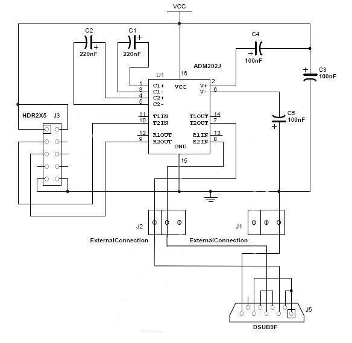
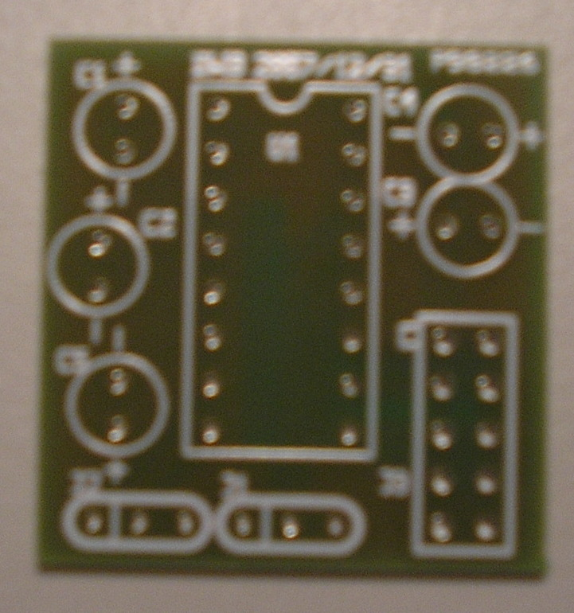
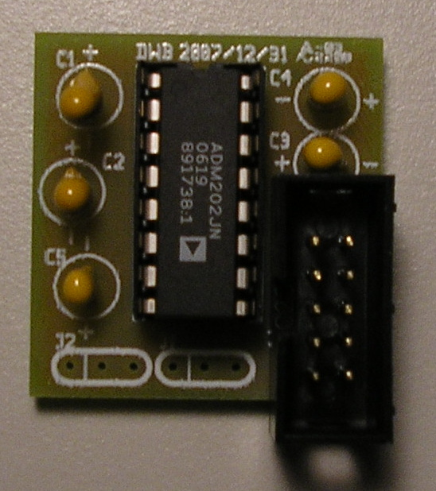
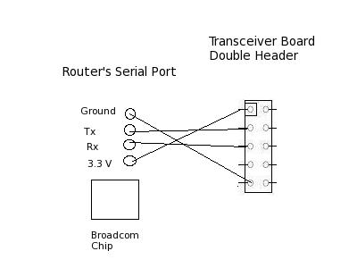
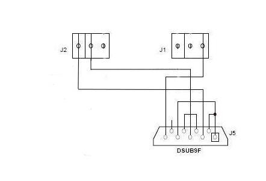

Modifying the ASUS hardware
===========================

Summary
-------

The purpose of this walk through is to explain how to add hardware to
the ASUS wl-330gE router to take advantage of the serial port on the
router and use it to communicate with the serial console for |EX|.
This communication is important for interacting with the :doc:`Common
Firmware Environment <Common-Firmware-Environment>`'s, or :doc:`CFE
<Common-Firmware-Environment>`, command line interface which is
necessary to run |EX| on the router.

Before Starting
---------------

**NOTE:** The following lists all the *necessary* parts. However, the
following tutorial describes assembling the transceiver on one of our
custom transceiver boards. One could assemble the parts of the entire
transceiver properly without the board, but with more difficulty.  Our
transceiver board design is freely available for public use.

- `Transceiver schematic
  <http://www.mscs.mu.edu/~brylow/xinu/Xinu-Transceiver.ps>`__ is in
  postscript format, suitable for `XCircuit
  <http://opencircuitdesign.com/xcircuit/>`__.

- `Transceiver PCB layout <http://www.mscs.mu.edu/~brylow/xinu/Xinu-Transceiver.pcb>`__
  is in `PCB format <http://pcb.sourceforge.net/>`__.

- `Transceiver fabrication tarball
  <http://www.mscs.mu.edu/~brylow/xinu/Xinu-Transceiver.tgz>`__
  contains Gerber photoplotter and CNC drill files suitable for
  professional fabrication.  (No warranty express or implied,
  obviously.)

Parts List
~~~~~~~~~~
.. list-table::
    :widths: 5 15 20 15 5
    :header-rows: 1

    * - Quantity
      - Part Name
      - Details
      - Part / Model Number
      - Price
    * - 1
      - ASUS [[wl-330gE]] Router
      - 802.11b/g wireless access point
      - http://usa.asus.com/
      - ~$40.00
    * - 1
      - IDC socket connector
      - 4 pin header
      - Jameco
      -
    * - 1
      - IDC socket connector
      - 5 pin header
      - Jameco
      -
    * - 1
      - IDC shrouded double header
      - 0.1”, 10 conductor
      - Jameco 67811CM
      - $0.33
    * - 1
      - ADM202 Transceiver Chip
      - Serial Transceiver ADM202EAN
      - Jameco 1800464
      - $1.60
    * - 2
      - Capacitor 220 nF
      - Tantalum,.22uF,35V,10%
      - Jameco 33507
      - $0.18
    * - 3
      - Capacitor 100 nF
      - Tantalum,.1uF,35V,10%
      - Jameco 33488
      - $0.22
    * - 1
      - DB9 Female
      - 22AWG,SOLDER CUP
      - Jameco 15771CM
      - $0.59

(We provide this parts list as a data point; we offer no guarantees
about current prices, and it is not our intent to endorse any
particular vendor.)

Tools List
~~~~~~~~~~

- Soldering Iron
- Dremel tool (for cutting holes in plastic case)
- Continuity Tester (Multimeter, or some other way of checking for
  proper connections)
- Voltmeter (Multimeter will work for this, too)

Steps to Modify the Hardware
----------------------------

Task One: Open the Router
~~~~~~~~~~~~~~~~~~~~~~~~~

Using a screwdriver, remove the two nails located underneath the
router and gently remove the top of the router from the bottom,
revealing the PCB.

**DO NOTE: This is where the warranty on the router is voided!**

Task Two: Attach the Serial Header
~~~~~~~~~~~~~~~~~~~~~~~~~~~~~~~~~~

The PCB is easily removable at this state from the router. Located in
the center of the PCB is the Broadcom BCM5354 chip. Above the chip are
four holes that are aligned vertically. The four holes represent the
input and output for the serial interface, along with the 3.3 volt
power and ground sources for the serial port.

For easier connectivity, we can use a 4-pin header on the board to
easily attach and detach a 4 connection cable. Use a soldering iron to
solder the 4-pin header onto the board.

Task Three: Create space for access to serial port on the router
~~~~~~~~~~~~~~~~~~~~~~~~~~~~~~~~~~~~~~~~~~~~~~~~~~~~~~~~~~~~~~~~

Using a dremel or other power tool, carefully cut out a rectangular
shaped hole on the faceplate of the router. The hole should be cut
above the words “Portable” and it should be 3 mm wide and 1 cm in
height, or enough to see the serial port through the hole. This will
be used for a 4-wired cable to attach the router to the transceiver
board, detailed in step seven.

Task Four: Creating the ADM202 Transceiver Circuit Board
~~~~~~~~~~~~~~~~~~~~~~~~~~~~~~~~~~~~~~~~~~~~~~~~~~~~~~~~

   Schematic showing the connections between the components of the
   ADM202 transceiver circuit board and between the board and the DB9
   serial port.

   Blank transceiver board before adding components.

   Transceiver board with all components in place except ribbon cables.

A transceiver circuit is needed to convert the 3.3 volt serial signals
from the router to conventional RS-232 serial voltages. To do this, we
need a small square of “perf board”, or other circuit prototyping
techniques. A soldering iron needs to be used to solder the components
onto the board.

Solder the shrouded double header, the socket, and the capacitors onto
the board. The direction of the pins matter due to their polarity.

Once the components have been placed on the board, use a continuity
tester to check the connection between the header soldered into the
router's board and the socket on the transceiver board. Now the ADM202
chip can be inserted onto the board. Next, wires need to be soldered
onto the bottom of the transceiver board. Since this router only has
one transceiver board, only three of the holes need wires. Under the
J2 label, solder wires into the two left most holes. Under the J1
label, which is under the chip, solder a wire on the right most hole.

Task Five: Attach Transceiver Board to the Router
~~~~~~~~~~~~~~~~~~~~~~~~~~~~~~~~~~~~~~~~~~~~~~~~~

The easiest way to accomplish this is to use an 4-wire audio cable
between the router's serial header and the shrouded double header on
the transceiver board. Using the 4-pin header on the router, connect
the four wires from the audio cable into the 4-pin header. On the
transceiver board, follow the diagram to match the corresponding
cables on the shrouded double header, but using a 5-pin serial header
to easily attack to the shrouded double header.

   Schematic showing the connections between the components of the
   ADM202 transceiver circuit board and between the board and the DB9
   serial port.

Task Six: Attach Transceiver Board to DB9 Serial Ports
~~~~~~~~~~~~~~~~~~~~~~~~~~~~~~~~~~~~~~~~~~~~~~~~~~~~~~

Since the router is very small, it will not have space to place the
DB9 Serial Port. Therefore, a small container needs to be created to
encase all of the components. This will be discussed in step seven.
Take the three wires from the transceiver board and attach them to the
DB9 female according to the diagram. Make sure that the solder cups 1,
4, and 6 are connected to each other and solder cups 7 and 8 are
connected to each other in the DB9 Female serial port. Notice that in
the case of the DB9 Female the T1OUT pin of the ADM202 transceiver
chip needs to be connected to solder cup 2, the R1IN pin of the ADM202
transceiver chip needs to be connected to solder cup 3, and the ground
needs to be connected to solder cup 5.

   Diagram demonstrating proper wiring between the transceiver board
   and the DB9 serial port.

Now you can use a continuity tester to make sure that all the
connections are good and that no wires or solder cups are touching.
The router should be placed back it its case, and the box keeping all
the components together should separate the router from the
transceiver board.  It will be very bad if the circuit board and the
transceiver board were to touch.

Task Seven: Creating a box case for the component
~~~~~~~~~~~~~~~~~~~~~~~~~~~~~~~~~~~~~~~~~~~~~~~~~

The ASUS router is small, but because of this, there is no space for
the DB9 female serial port, the adaptor, the relay, and the
transceiver board. Because of this, a box is needed to enclose all of
these components together. The box should have holes cut out for the
DB9 female serial port, the power adapter and the Ethernet port. Also,
a small barrier needs to be placed between the transceiver board and
the relay so they do not meet. The PCB can be safely placed inside the
ASUS router case.

What to do next?
----------------

Connect UART0 (the DB9 Female serial port) to a computer and follow
the next HOWTO on using a PC to :doc:`connect to a modified router
<HOWTO-Connect-to-Modified-Router>`.

References
----------

*This work is supported in part by NSF grant DUE-CCLI-0737476.*
