Modifying the Linksys hardware
==============================

Summary
-------

This will walk through adding hardware to a `Linksys
<http://www.linksys.com>`__ :doc:`WRT54GL <WRT54GL>` wireless router
that will take advantage of existing connections on the PCB for two
UART connections, which will be exposed as DB9 serial port connectors
mounted to the faceplate of the router.  These connections can be used
to communicate with the serial console for |EX| and also to interact
with the :doc:`Common Firmware Environment
<Common-Firmware-Environment>`'s command line interface.  Gaining
direct access to :doc:`CFE <Common-Firmware-Environment>` is a key
step towards being able to run |EX| on the router.

Before Starting
---------------

**NOTE:** The following lists all the *necessary* parts. However, the
following tutorial describes assembling the transceiver on one of our
custom transceiver boards. One could assemble the parts of the entire
transceiver properly without the board, but with more difficulty.  Our
transceiver board design is freely available for public use.

- `Transceiver schematic
  <http://www.mscs.mu.edu/~brylow/xinu/Xinu-Transceiver.ps>`__ is in
  postscript format, suitable for `XCircuit
  <http://opencircuitdesign.com/xcircuit/>`__.

- `Transceiver PCB layout <http://www.mscs.mu.edu/~brylow/xinu/Xinu-Transceiver.pcb>`__
  is in `PCB format <http://pcb.sourceforge.net/>`__.

- `Transceiver fabrication tarball
  <http://www.mscs.mu.edu/~brylow/xinu/Xinu-Transceiver.tgz>`__
  contains Gerber photoplotter and CNC drill files suitable for
  professional fabrication.  (No warranty express or implied,
  obviously.)

Parts List
~~~~~~~~~~

.. list-table::
    :widths: 5 15 20 15 5
    :header-rows: 1

    * - Quantity
      - Part Name
      - Details
      - Part / Model Number
      - Price
    * - 1
      - Linksys :doc:`WRT54GL <WRT54GL>` Router
      - 802.11b/g wireless broadband router
      - `Linksys WRT54GL <http://www.linksys.com/servlet/Satellite?c=L_Product_C2&childpagename=US%2FLayout&cid=1133202177241&pagename=Linksys%2FCommon%2FVisitorWrapper>`__
      - ~$65.00
    * - 1
      - Ribbon cable
      - 28 AWG, 10 conductor, 25'
      - Jameco  643508CM
      - $4.99
    * - 2
      - IDC socket connector
      - 0.1”, 10 conductor
      - Jameco  32491CM
      - $0.25
    * - 2
      - IDC shrouded double header
      - 0.1”, 10 conductor
      - Jameco 67811CM
      - $0.33
    * - 1
      - ADM202 Transceiver Chip
      - Serial Transceiver ADM202EAN
      - Jameco 1800464
      - $1.60
    * - 2
      - Capacitor 220 nF
      - Tantalum,.22uF,35V,10%
      - Jameco 33507
      - $0.18
    * - 3
      - Capacitor 100 nF
      - Tantalum,.1uF,35V,10%
      - Jameco 33488
      - $0.22
    * - 1
      - DB9 Female
      - 22AWG,SOLDER CUP
      - Jameco 15771CM
      - $0.59
    * - 1
      - DB9 Male
      - 22AWG,SOLDER CUP
      - Jameco 15747CM
      - $0.59

(We provide this parts list as a data point; we offer no guarantees
about current prices, and it is not our intent to endorse any
particular vendor.)

Tools List
~~~~~~~~~~

- Soldering Iron
- Dremel tool (for cutting holes in plastic case)
- Continuity Tester (Multimeter, or some other way of checking for proper connections)
- Voltmeter (Multimeter will work for this, too)

Steps to Modify the Hardware
----------------------------

Task One: Open the Router
~~~~~~~~~~~~~~~~~~~~~~~~~

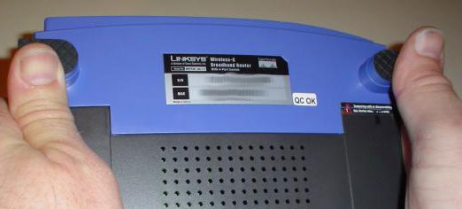

   It's really very easy.

There are no screws or tools needed to open the router, just pop open
the front with your thumbs as shown in the picture.  Some nice
`illustrated opening instructions
<http://voidmain.is-a-geek.net/redhat/wrt54g_revival.html>`__ can be
found for a more detailed explanation of this step.

**DO NOTE: This is where the warranty on the router is voided!**

Task Two: Attach the Serial Header
~~~~~~~~~~~~~~~~~~~~~~~~~~~~~~~~~~

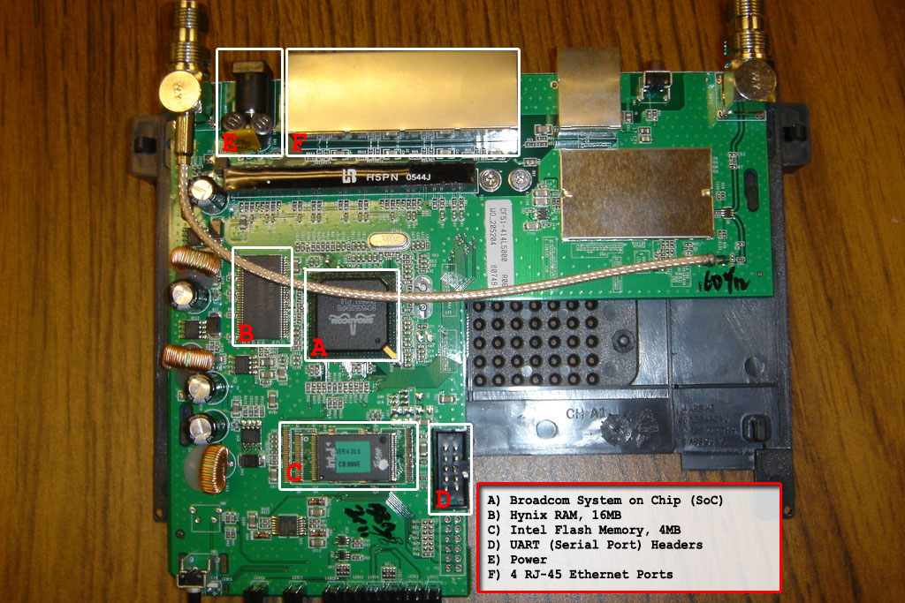

   An overhead view to get your bearings. The serial header is (D) here.

First you need to unscrew the two screws keeping the router's board
attached to the case. Once the PCB has been removed from the case,
locate the serial header holes provided by Linksys. This would be a
grid of 10 holes (5x2) located on the bottom-right corner of the board
when the antennae stubs are on top (see the top-down photo for
clarification). These ten holes hold all of the input and output for
the two serial interfaces--UART0, and UART1--on the device.

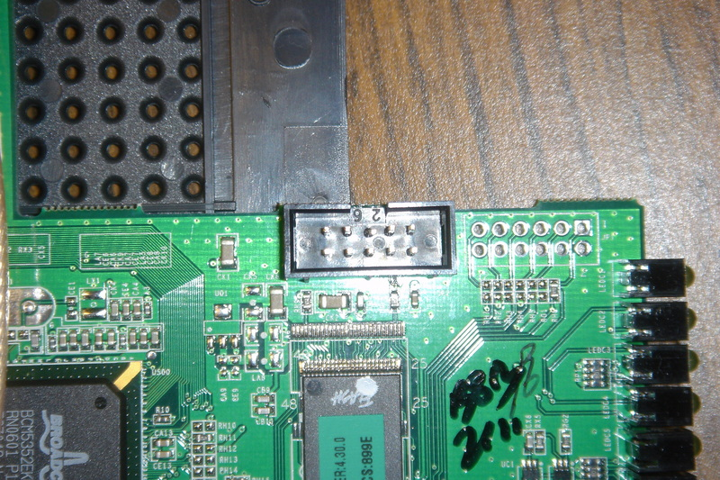

   A closer look at our attached serial header.

Now, we could just solder wires right onto these holes, but a by
placing a nice 10-pin header on the board we can easily attach and
detach a 10 connection cable.  Here you will use your **soldering
iron** to solder the **IDC shrouded double header** onto the board.
Make sure to note where the 1 pin is on the board (marked with a
square around the hole instead of a circle) and where the 1 pin is
located on the header (on ours it was marked with a triangle). Make
sure that these two line up when soldering the header into the board.

Task Three: Create the ADM202 Transceiver Circuit Board
~~~~~~~~~~~~~~~~~~~~~~~~~~~~~~~~~~~~~~~~~~~~~~~~~~~~~~~

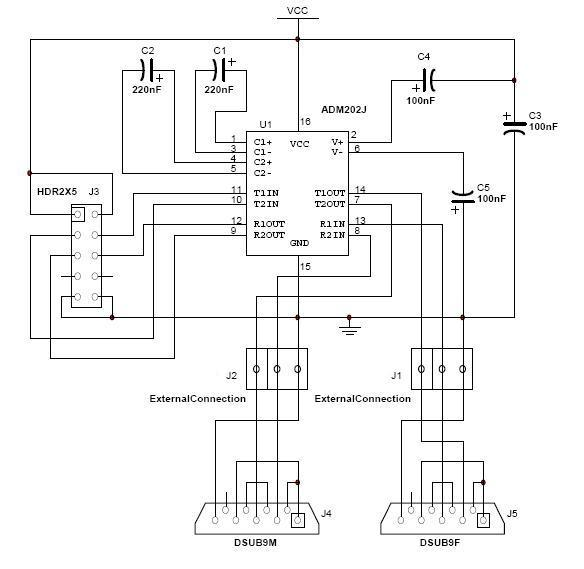

   Schematic showing the connections between the components of the
   ADM202 transceiver circuit board and between the board and the DB9
   serial ports.

.. figure:: images/Transceiver_board.jpg
   :figwidth: 200px
   :width:    200px
   :scale:    100%
   :align:    right

   Blank transceiver board before adding components.

.. figure:: images/Complete_transceiver_board.jpg
   :figwidth: 200px
   :width:    200px
   :scale:    100%
   :align:    right

   Transceiver board with all components in place except ribbon cables.

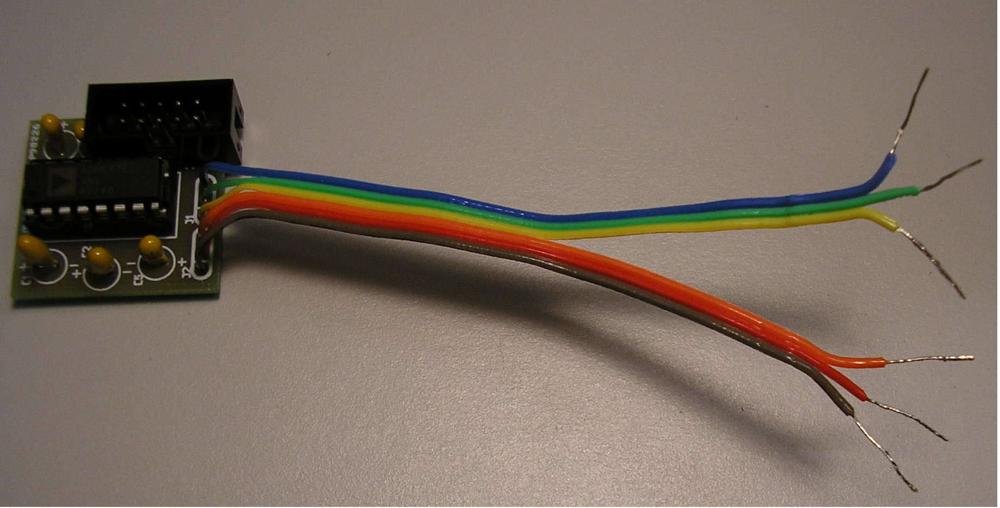

   Complete transceiver board with all components in place.

The next step is to build the transceiver circuit, which converts the
3.3 volt serial signals from the router to conventional RS-232 serial
voltages.  The circuit includes only a handful of components, so it
can be assembled using a small square of "perf board", or a variety of
other inexpensive circuit prototyping techniques.  We use a
custom-made printed circuit board to simplify assembly, as shown here.
(Link to page with PCB specs, and directions.)  Again, you'll need
your **soldering iron** to secure the different pieces in the
transceiver board.

Using the diagram on the left, solder the **shrouded double
header**, the **socket**, and the **capacitors** into the board
in the appropriate places. **NOTE:** the positions of the components
on the physical board are not represented in the diagram, but the
silkscreen on the board indicates placement and orientation.
**FURTHER NOTE:** each component has a proper polarity or pin
marking -- direction matters!

The pictures to the right show the transceiver board in various stages
of completion. The top one shows the blank board on which the other
components will be added. The bottom one shows the **shrouded double
header**, the **socket**, and the **capacitors** soldered in
place. It also shows the actual ADM202 chip inserted into the socket,
however, before inserting the chip it is a good idea to test what
you've completed so far.

Use a **continuity tester** to check the connection between the
header soldered into the router's board and the socket on your
transceiver board. The next step we recommend for testing your work is
to plug in the router and use a **voltmeter** to check that the
*ground* and *power* pins on the socket (pins 15 and 16) are
registering at 3.3 volts. Now, actually insert the ADM202 chip into
the socket and power up the router again, making sure that the lights
turn on and nothing shorts out.

The next step is to get six wires from a chopped up piece of the
ribbon cable (or any six spare wires) and solder them into place in
the six holes (two sets of three) at the bottom of the transceiver
board. The resulting completed transceiver board should look something
like the picture below the diagram.

Task Four: Attach Tranceiver Board to the Router
~~~~~~~~~~~~~~~~~~~~~~~~~~~~~~~~~~~~~~~~~~~~~~~~

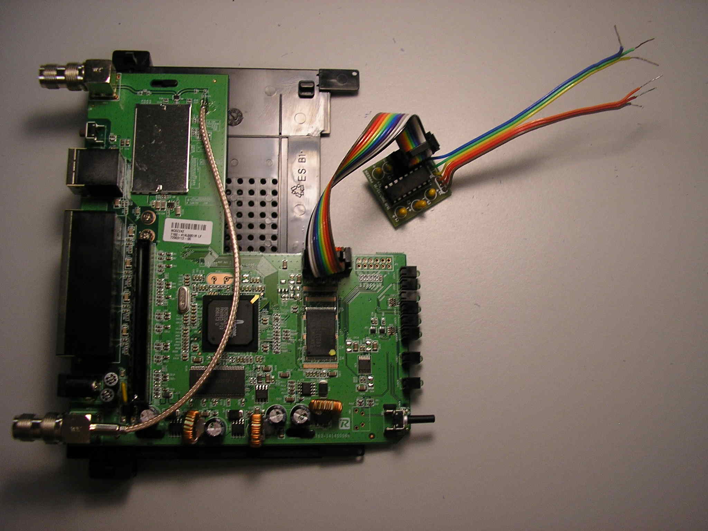

   Transceiver board attached via ribbon cable to the serial header
   soldered into the router's board.

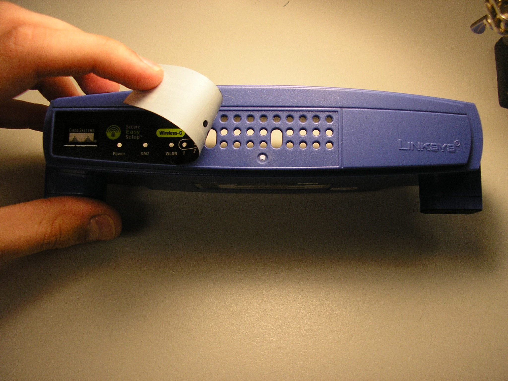

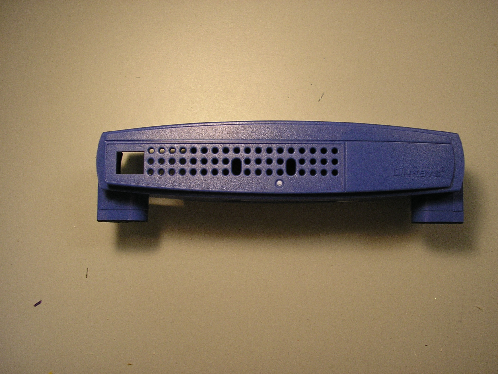

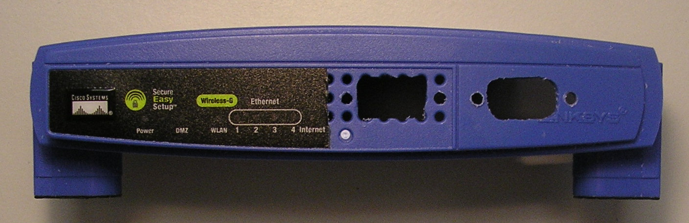

First take a piece of ribbon cable and attach each end to one of your
IDC socket connectors. Notice the marker on the connector that
signifies where pin 1 of the header will connect to. Make sure that
the same side of the ribbon cable is attached to the marked side of
both connectors. In other words make sure that the same wire will line
up with pin 1 on both headers when the connectors are eventually
attached to the headers. The next step is to actually plug in the
connectors to the headers. Attach one connector to the header we
soldered into the router's board and the other connector to the header
we soldered into the transceiver board. The result should look
something like the picture to the left. Now is a good time to reattach
the router's board to its case by screwing the two screws into place
and then closing up both black pieces of the back part of the router's
case.

Task Five: Attach Transceiver Board to DB9 Serial Ports
~~~~~~~~~~~~~~~~~~~~~~~~~~~~~~~~~~~~~~~~~~~~~~~~~~~~~~~

Before soldering the wires from the transceiver board to the serial
ports, it is a good idea to drill two holes in the front of the
router's casing to use for the serial ports and also two small holes
on each side of the bigger ones to use for screws or bolts to keep the
**DB9 Serial Ports** in place. The three pictures to the right show
how to take off the front sticker and what the case should look like
after you've drilled two holes in the front for the serial ports. It
is also a good idea to cut the sticker and place the left part back on
to cover up the remaining holes in the casing.

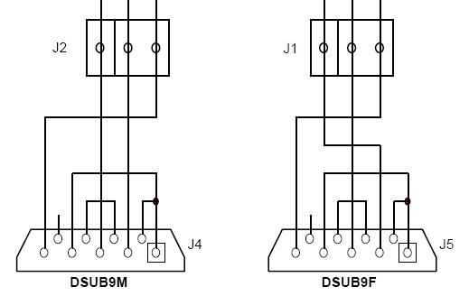

   Diagram of wiring to connect the two DB9 serial ports to the
   transceiver board.

Next, feed the six wires coming from the transceiver board through the
two holes you just drilled. Make sure that the three wires soldered
into the holes marked **J1** on the transceiver board go through the
hole on the left of the front of the router and the three wires
soldered into the holes marked **J2** on the transceiver board go
through the hole on the right of the front of the router.

Following the diagram to the left, solder some spare wires or chopped
pieces of ribbon cable into the two DB9 serial ports. Notice that
solder cups 1, 4, and 6 are connected to each other and solder cups 7
and 8 are connected to each other on both the **DB9 Female** and **DB9
Male** serial ports. Then, again following the diagram, solder in the
wires coming from **J1** into the appropriate solder cups of the **DB9
Female** and the wires coming from **J2** into the appropriate solder
cups of the **DB9 Male**.

Notice that in the case of the **DB9 Female** the *T1OUT* pin of the
ADM202 transceiver chip needs to be connected to solder cup 2, the
*R1IN* pin of the ADM202 transceiver chip needs to be connected to
solder cup 3, and the *ground* needs to be connected to solder cup 5.

Also, notice that in the case of the **DB9 Male** the *R2IN* pin of
the ADM202 transceiver chip needs to be connected to solder cup 2, the
*T2OUT* pin of the ADM202 transceiver chip needs to be connected to
solder cup 3, and the *ground* needs to be connected to solder cup 5.

Feeding the wires through the holes and connecting the serial ports in
this way ensures that the router's primary serial device will be
connected to the **DB9 Female** serial port and will be located on the
left side while the router's secondary serial device will be connected
to the **DB9 Male** serial port and will be located on the right side
of the front of the router.

After all the soldering is done it is a good idea to use a
**continuity tester** to make sure that all the connections are good
and no wires or solder cups may be accidentally touching. Your result
should look something like the pictures below. Now is a good time to
tape the transceiver board down to the front of the case. It would be
extremely bad for the transceiver board to rub up against the router's
circuit board when it was plugged in.

========================   =========================
|Serial_ports_done|        |Serial_ports_done1|
------------------------   -------------------------
|Serial_ports_done_capt|   |Serial_ports_done1_capt|
========================   =========================

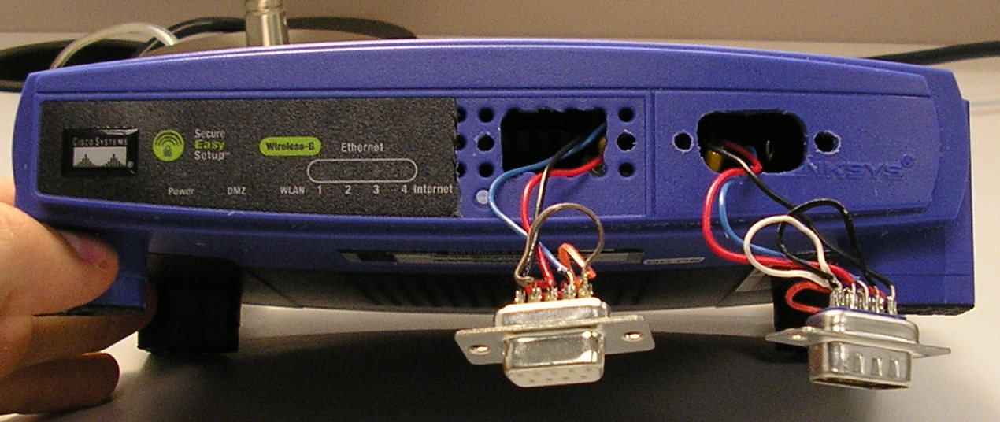

.. |Serial_ports_done_capt| replace::
   Front view of what the router will look like after the DB9 serial
   ports are correctly soldered into place, but before they have been
   screwed and secured into the router's case.

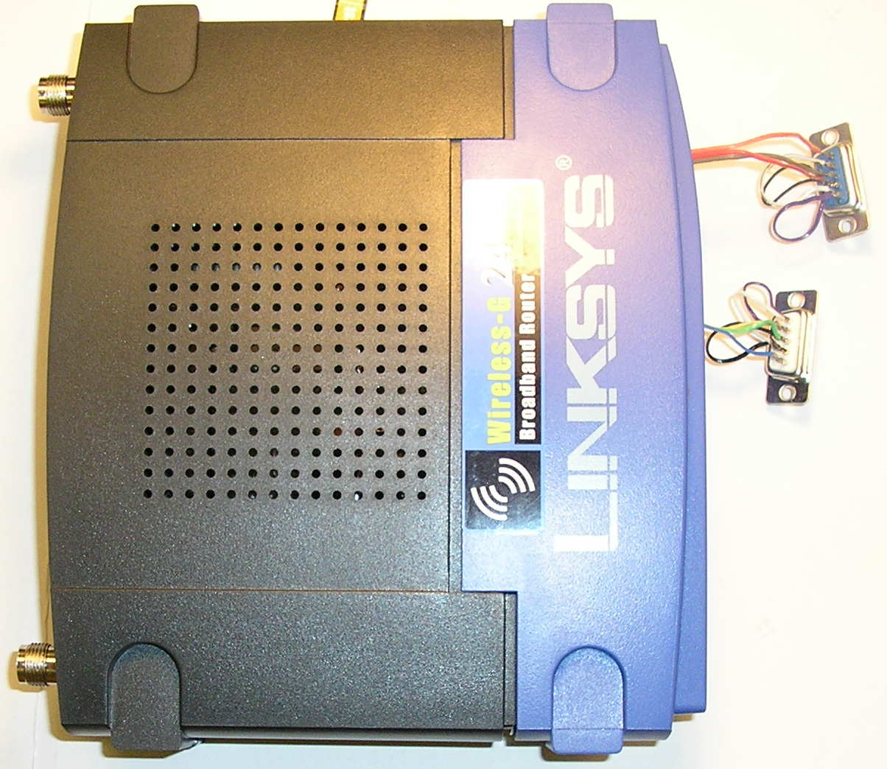

.. |Serial_ports_done1_capt| replace::
   Overhead picture of what the router will look like
   after the DB9 serial ports are correctly soldered
   into place, but before they have been screwed and
   secured into the router's case.

Task Six: Close the Router
~~~~~~~~~~~~~~~~~~~~~~~~~~

This final task is best described in photos:

========================   =========================
|Attach_Back|              |Attach_Front|
------------------------   -------------------------
|Attach_Back_capt|         |Attach_Front_capt|
========================   =========================

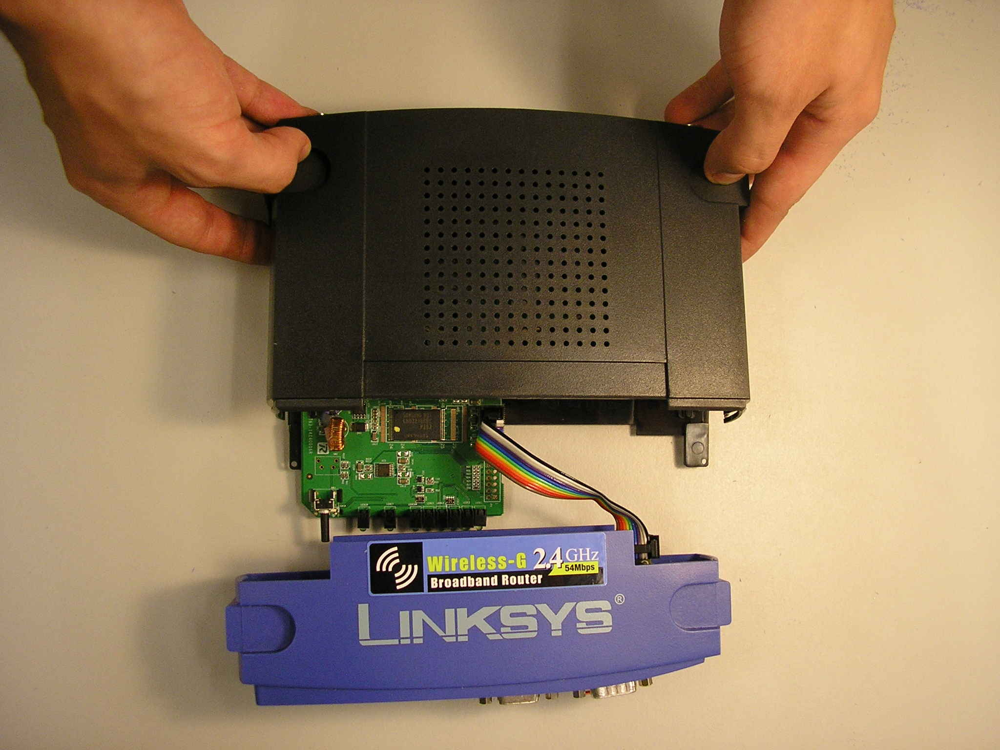

.. |Attach_Back_capt| replace::
   Now that everything is connected we can re-assemble it.  First you
   put on the back/top half.  Keyed ribbon cable is plugged in to
   serial port header on circuit board.

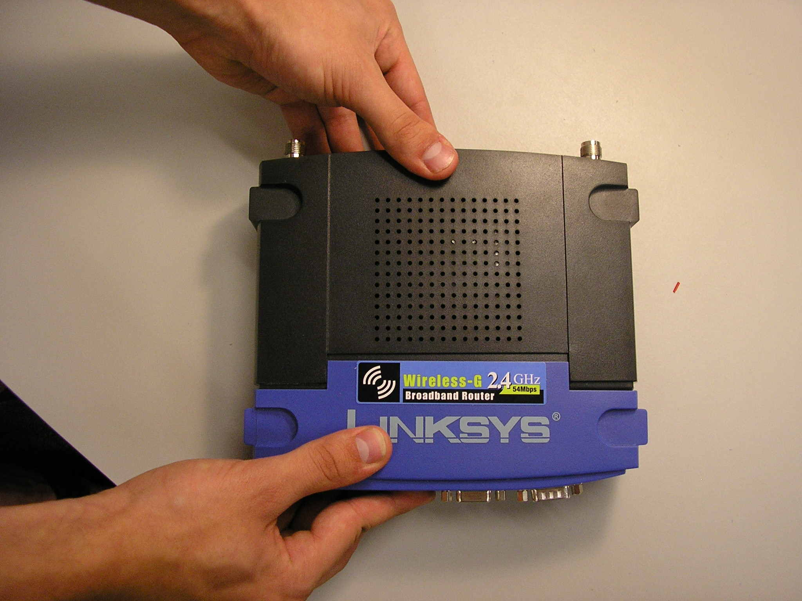

.. |Attach_Front_capt| replace::
   Next you can carefully install the front half (making sure not to
   break any of the wires we have).

Task Seven: Rejoice
~~~~~~~~~~~~~~~~~~~

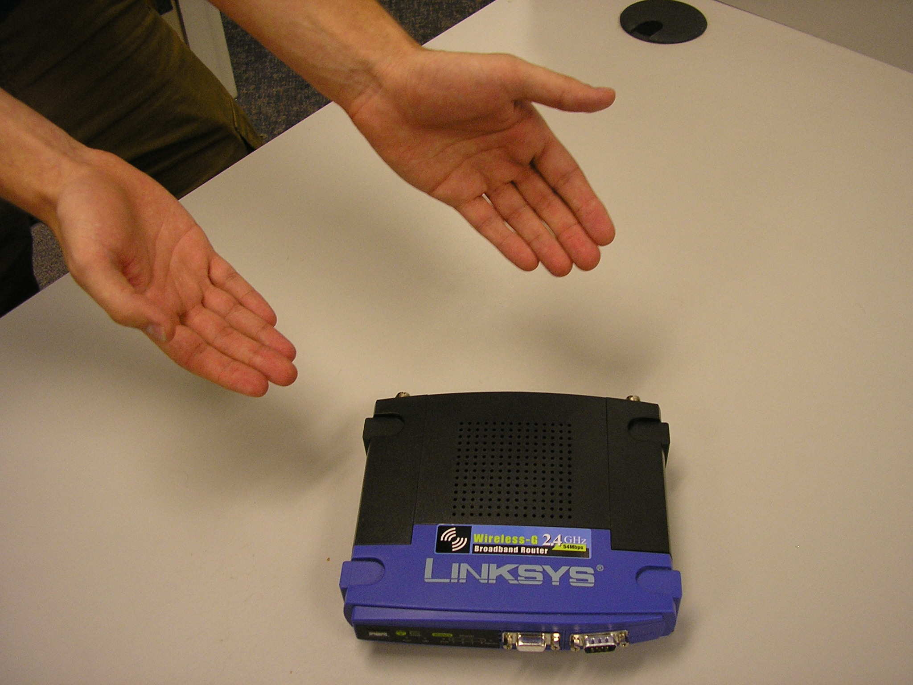

   Now you have a WRT54GL with two serial ports installed and ready
   to run your own operating system.

What to do next?
----------------

Connect UART0 (the DB9 Female serial port) to a computer and follow
the next HOWTO on using a PC to :doc:`connect to a modified router
<HOWTO-Connect-to-Modified-Router>`.

Acknowledgements
----------------

*This work is supported in part by NSF grant DUE-CCLI-0737476.*
