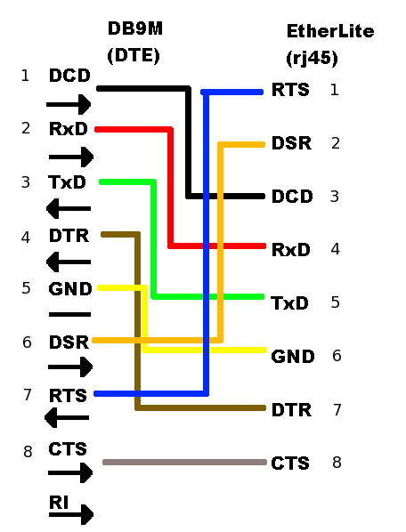
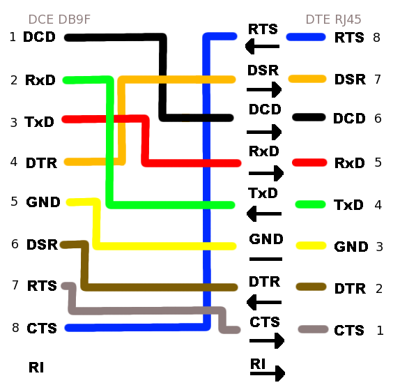
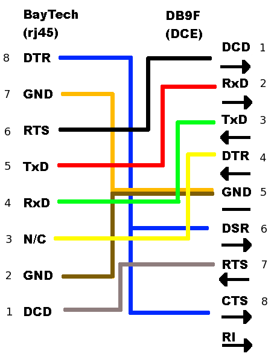

Serial adapter diagrams
=======================

RJ45/DB9 adapters
-----------------

Below are diagrams for RJ45 to DB9 adapters allowing connection
between an `Etherlite serial bay and XINU backends
</teaching/HOWTO-Build-Backend-Pool>` in a pool. The first diagram is
for UART 0 (DTE). The second diagram is for the platform-dependent
UART 1 (DCE).

Null Modem
----------

The null modem adapter is required to make connections between
available UART 1 ports on two machines. The above UART 1 diagram
functions as a null modem when connecting directly to other backends,
as well as to the EtherLite serial bay.

EtherLite to Baytech
--------------------

The third diagram represents a connection between the between a
Baytech serial-controlled power strip and the EtherLite terminal annex.
The final two diagrams are the Baytech/Etherlite diagram broken into two
parts, representing the mating of two individual RJ45/DB9 adapters.

.. image:: images/BaytechWiring.png
   :width: 500px
   :align: center

