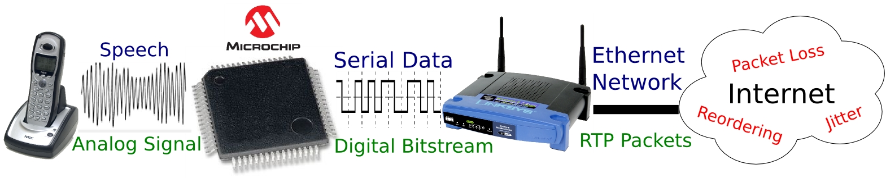
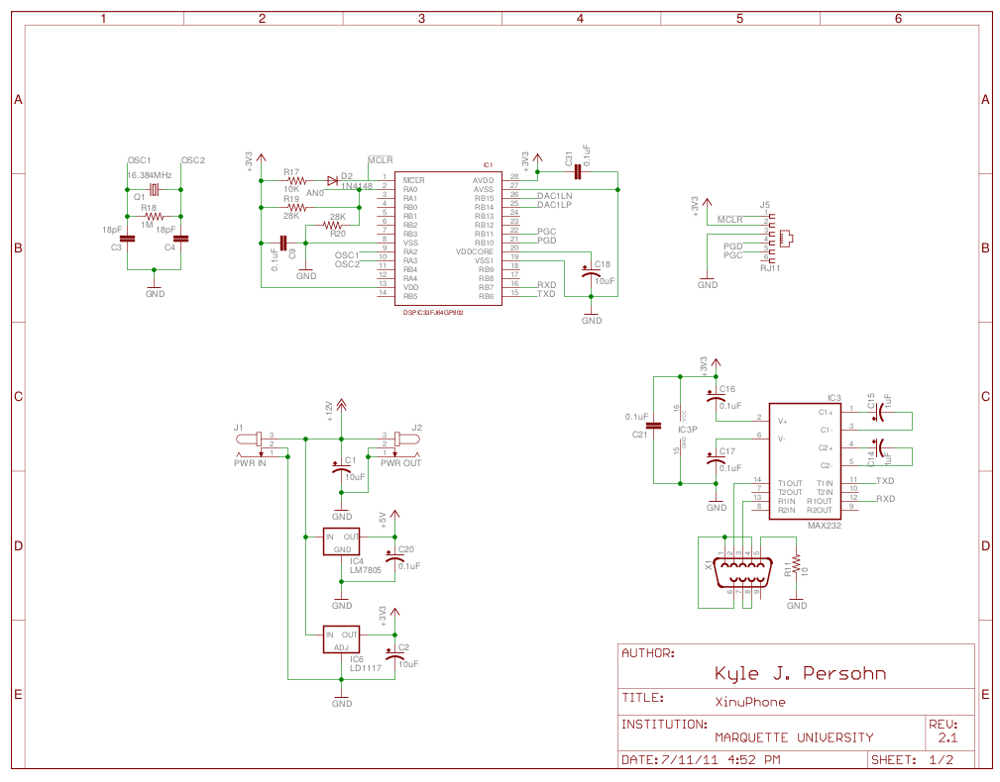
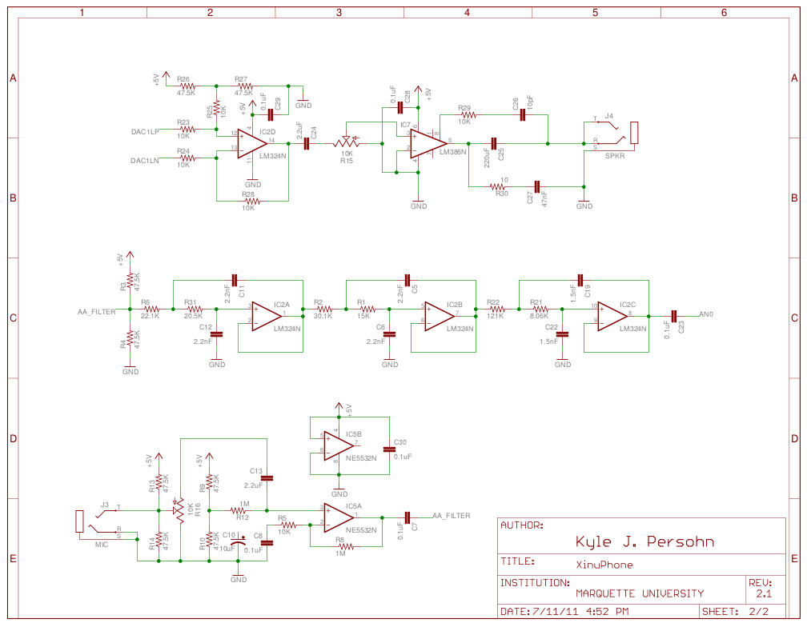

XinuPhone
=========

XinuPhone is an innovative hardware/software platform for Internet
telephony education and research. In the classroom, XinuPhone promotes
hands-on interactive learning that is both cross-discipline and
application oriented. As a research tool, XinuPhone is a versatile and
open-source platform useful for benchmarking experimental methods
against industry standards. Furthermore, the XinuPhone platform features
inexpensive commodity hardware that is easy to assemble making it an
idea choice for users on tight budgets and in diverse educational
backgrounds.

How It Works
------------

Most of the Embedded Xinu :ref:`supported platforms
<supported_platforms>` do not have the ability to directly `sample
analog signals
<http://en.wikipedia.org/wiki/Nyquist%E2%80%93Shannon_sampling_theorem>`__
or `reconstruct analog waveforms
<http://en.wikipedia.org/wiki/Digital-to-analog_converter>`__ from
digital bitstreams. Likewise, typical digital signal processing (DSP)
chips lack Ethernet networking hardware and protocol support.
XinuPhone pairs a simple external sampling module with a
network-enabled backend running the Embedded Xinu operating system in
order to provide both functionalities.

The XinuPhone audio module consists of filters, a digital signal
controller (DSC), an audio amplifier, and a serial transceiver. Speech
first passes through an analog low-pass anti-aliasing filter before it
enters the analog to digital converter (ADC) on the DSC. The DSC can be
programed with a variety of software
`CODECs <http://en.wikipedia.org/wiki/Codec>`__ that compress the
sampled audio for efficient transmission across the serial bus. The
serial transceiver allows the audio module to interface directly with an
RS-232 capable network device, such as a slightly modified Linksys
WRT54GL router. The audio module sends serial samples to the network
device; then, the Embedded Xinu operating system
`VoIP <http://en.wikipedia.org/wiki/Voice_over_IP>`__ tools packetize
the serial data and send the voice packets to a remote host. On the
receiving end, another network device buffers incoming packets and
translates the payloads back into a stream of serial data. The external
audio module uses the same CODECs to uncompress the serial data back
into raw audio samples. Lastly, a digital to analog converter (DAC)
on-board the DSC converts the audio samples back to an analog waveform
that can be amplified and played back.

Hardware
--------

You can build your own XinuPhone with readily available discrete
components!

Schematics
^^^^^^^^^^

Sheet 1 shows the basic DSC core, power supply, crystal oscillator,
debug interface, and serial transceiver connections.

Sheet 2 illustrates the headphone amplifier, microphone pre-amplifier,
and low-pass anti-aliasing filter.

Click on the sheet for a higher resolution image or see the downloads
below for a PDF rendering.

Design Notes
^^^^^^^^^^^^

-  Components are specified to EIA E96 standard values for resistors (1%
   tolerance) and E24 values for capacitors.
-  For capacitors in the audio path, temperature coefficient X7R, NP0,
   C0G, or better are recommended.

Downloads
---------

.. list-table::
   :widths: 25 8 25
   :header-rows: 1

   * - File
     - Download Link
     - Checksum (SHA1)
   * - XinuPhone Firmware 1.0 (Binary+Source)
     - `gzip <http://www.mscs.mu.edu/~kpersohn/xinuphone/download/xinuphone-1.0.tar.gz>`__
     - 8aa4b4d7ed38c4c641e920905aabfee1a9d2dbc0
   * -
     - `bzip2 <http://www.mscs.mu.edu/~kpersohn/xinuphone/download/xinuphone-1.0.tar.bz2>`__
     - 6ecfecbb9d9bc399b961d0764923ce609b4c569a
   * - XinuPhone Hardware Schematic Rev 2.1
     - `pdf <http://www.mscs.mu.edu/~kpersohn/xinuphone/xinuphone.pdf>`__
     - a0f07d543f2b85440c31daa7d530066f682a8a5a
   * - Embedded Xinu Operating System
     - `url <http://xinu-os.org/Downloads>`__
     -

Instructional Resources
-----------------------

-  Interactive Real-Time Embedded Systems Education Infused with Applied
   Internet Telephony. Kyle Persohn, Dennis Brylow. COMPSAC 2011:
   Proceedings of 35th IEEE Computer Software and Applications
   Conference, pages 199-204, Munich, Germany, July 2011.
   `link <http://dx.doi.org/10.1109/COMPSAC.2011.33>`__
-  :doc:`/teaching/index`

Future Work
-----------

-  Real-Time Transport Protocol support in Embedded Xinu
-  Analog Telephone Adapter (ATA) interface
-  Simple XinuPhone discovery protocol / address book

External Links
--------------

Some additional resources you may find useful

Microchip
^^^^^^^^^

-  `dsPIC33FJ64GP802 Product Home <http://www.microchip.com/wwwproducts/Devices.aspx?dDocName=en532310>`__
-  `MPLAB IDE <http://www.microchip.com/stellent/idcplg?IdcService=SS_GET_PAGE&nodeId=1406&dDocName=en019469&part=SW007002>`__
-  `Audio & Speech Application Libraries <http://www.microchip.com/stellent/idcplg?IdcService=SS_GET_PAGE&nodeId=2660&param=en535144>`__

Standards & RFCs
^^^^^^^^^^^^^^^^

-  `ITU-T Test Signals for Telecommunication Systems <http://www.itu.int/net/itu-t/sigdb/genaudio/Pseries.htm>`__
-  `ITU-T G.711 - Pulse Code Modulation (PCM) of Voice Frequencies <http://www.itu.int/rec/T-REC-G.711/en>`__
-  :rfc:`RFC 3550 - RTP: A Transport Protocol for Real-Time Applications <3550>`

PCB Fabrication
^^^^^^^^^^^^^^^

-  `Advanced Circuits <http://www.4pcb.com>`__
-  `CadSoft EAGLE Schematic Capture & Board Layout Software <http://www.cadsoftusa.com/>`__
-  `SparkFun Tutorials <http://www.sparkfun.com/tutorials>`__
